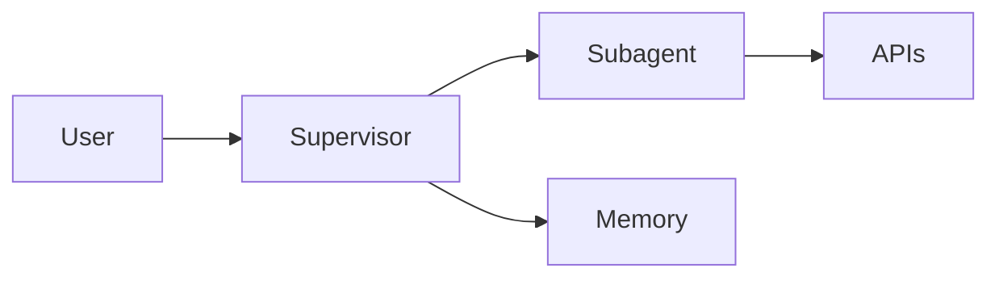
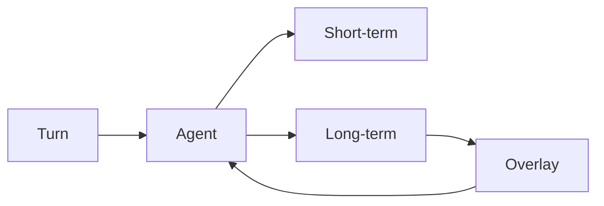
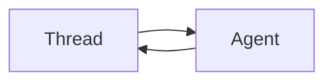
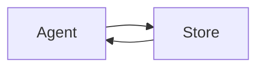
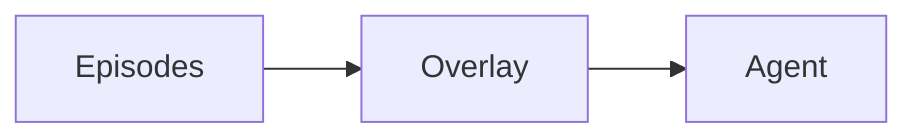

# django-auto-agent

Reusable Django app that turns opted-in Django REST Framework endpoints (and optional host `ModelAgent` classes) into a LangGraph assistant: a supervisor routes each logged-in user to per-app domain specialists, and those specialists call the host's own APIs or Python tools in-process.

Import name: `ai_agent`.

The usual alternative is a second chatbot codebase that reimplements what the product APIs already do, plus a pile of hand-tuned prompts that look great on a development dataset and then fail in production. This package is built for the opposite: reuse the Django app you already have, and let the agent **improve from real user interactions** (memory + prompt overlays) instead of overfitting those prompts offline.

The package walks the host URLconf, finds DRF views the host has opted in, and builds a LangChain tool for each HTTP method from the `drf-spectacular` OpenAPI schema (path, query, and body arguments). Tools are grouped by Django app into **domain subagents**. A **supervisor** agent routes the request to the matching specialist (or several, when the user asks about more than one domain).

Tool execution does not go over the network. The library builds a DRF request, `force_authenticate`s it as the JWT user, and invokes the view. The model never receives a user id; tools always run as that authenticated user.

Optional pieces, all off or conservative by default:

- Long-term memory (LangMem + a LangGraph store), with a curator, caps, and prompt overlays that evolve from live traffic
- Conversation compaction that does not stream into AG-UI chat
- Django admin for threads, memories, prompt overlays, and user-visible messages
- Native AG-UI HTTP (`/agui`) on the LangGraph Agent Server — any AG-UI client, not a lock-in to one chat SDK
- Live-model evals against a host-supplied fixture world

This repository's `dummy` and `notes` apps plus `tests/settings.py` are a sample host. They are not installed with the wheel.



## Memory

The assistant keeps three kinds of state. They use different stores and different lifetimes:

| Kind | Store | Lifetime | What the model sees |
| --- | --- | --- | --- |
| Short-term | LangGraph **checkpointer** (plus optional compaction) | One chat **thread** | The current conversation, possibly summarized |
| Long-term | LangGraph **store** | One **user** × **layer** (supervisor or a Django app) | Profile, facts, episodes, playbook recalled into the system prompt |
| Prompt overlays | Same store, `prompt` namespace | Local: one user × layer. Global: every user on that layer | Extra standing instructions prepended on recall |

Product chat history (`AgentMessage`) is a fourth table: it is what the HTTP/UI shows after compaction, not what the model reads on the next turn.

### Overall flow

Each user turn loads the thread, recalls long-term memory and overlays into the system prompt, runs the supervisor (and specialists), then writes the checkpoint. After the turn, a debounced memory agent extracts durable facts; later a curator merges duplicates and may run the prompt optimizer. The next turn reads those store documents.



Timing when memory is on: the writer waits `MEMORY_DEBOUNCE_SECONDS` (default 30). The curator waits that plus `MEMORY_CURATOR_DELAY_SECONDS` (default 120). HITL interrupts skip both so a pending confirmation is not stored as a finished turn.

### Short-term memory

Short-term memory is the **conversation thread**. LangGraph checkpoints the message list, tool state, and mutation interrupts under `thread_id`. Domain specialists run on a child thread (`{parent}::{app_label}`) so their tool loops do not overwrite the supervisor checkpoint.

On the next message in the same thread, the checkpointer reloads that state. The model therefore sees prior turns in this chat, including pending `interrupt()` payloads the UI must resume.



**Compaction** (`COMPACTION_ENABLED`) is still short-term: it shrinks the checkpoint when the trigger (tokens, messages, or a fraction of context) is hit, keeping a recent window (`COMPACTION_KEEP`) and replacing older turns with a summary. Summarizer tokens are not streamed to AG-UI. Compacted checkpoints are **not** what `GET threads/<id>/messages/` returns; that API reads `AgentMessage`, which stores user-visible supervisor text and ignores compaction summaries.

Under tests or SQLite the checkpointer is in-memory. On the Agent Server, persistence is the platform/Postgres checkpointer for that deployment.

### Long-term memory

Long-term memory is **cross-session**. It lives in the LangGraph store (Agent Server / Postgres / Redis / in-memory — see `MEMORY_STORE`), keyed by user id and **layer**. The supervisor layer holds identity and cross-domain habits; each opted-in Django app has its own layer so a catalog specialist does not mix memories with billing.

Off until `MEMORY_ENABLED`. Four document types per user and layer:

| Document | Cardinality | Written by | Role |
| --- | --- | --- | --- |
| Profile | Exactly one | Memory agent or hot tools | Standing fields from that layer's Pydantic schema (name, language, domain knobs). Not the current task. |
| Semantic facts | Many | Memory agent or hot tools | Durable subject–predicate–object facts, searched by the latest user text (`MEMORY_SEARCH_LIMIT`). |
| Episodes | Many | Memory agent or hot tools | Reusable traces: situation, approach, outcome, including failures and how to avoid them. Not a chat log. |
| Playbook | Exactly one | **Curator only** | Short trigger / do / don't / why rules (capped by `MEMORY_PLAYBOOK_RULE_CAP`). |



**Recall** (`MemoryRecallMiddleware`) runs before every model call on that layer. It loads the profile and playbook, searches facts and episodes with the latest user text, loads prompt overlays, and appends a block to the system prompt (`<global_prompt>`, `<user_prompt>`, then `<profile>` / `<facts>` / `<episodes>` / `<playbook>`).

**Write** has two modes (`MEMORY_MODE`):

- **Background** (default): after the turn, a dedicated memory agent reads the transcript and writes profile / facts / episodes. The conversation model does not call memory tools. Playbooks stay curator-owned.
- **Hot**: the supervisor and specialists get LangMem manage/search tools during the turn. Same-turn delete of a document just created is refused. The curator still runs after the turn to merge and cap.

The memory agent is instructed to skip greetings, one-off requests, raw tool dumps, and anything that will not matter next session; prefer update over insert; never create a second profile document.

**Curator** (on by default when memory is on) is a separate graph (`memory_curator`):

1. Deterministic reconcile — merge duplicate facts/episodes, enforce `MEMORY_FACT_CAP` / `MEMORY_EPISODE_CAP` / `MEMORY_COLLECTION_CAP`.
2. LLM curate — remaining near-duplicates the rules could not merge (update/delete only; no new facts).
3. Local optimize — patch standing profile constraints and upsert the playbook from failure lessons.
4. Prompt optimize — maybe write a local overlay (below).

### Prompt optimization

Overlays are how the agent **auto-evolves**. The point is not to freeze a prompt that passed a development eval set, then discover it fails on real traffic. After each session, durable episodes (what the user needed, what the agent did, what worked or failed) become short trajectories. The optimizer turns those trajectories into extra standing instructions. The next turn loads them. The more people use the agent, the better the overlays get — without you hand-editing the system prompt for every new failure mode.

Two scopes so a personal lesson does not become everyone else's context:

| Scope | Namespace | When it runs | Guardrails |
| --- | --- | --- | --- |
| Local | `memories / {user_id} / {layer} / prompt` | After the curator, if there are at least `MEMORY_PROMPT_OPTIMIZER_MIN_NEW_EPISODES` new episodes (or a new failure). Also `manage.py optimize_agent_prompts --scope local`. | Max `MEMORY_PROMPT_OPTIMIZER_LOCAL_MAX_CHARS`. Frozen safety clauses must still be present when the overlay is concatenated with the base policy. |
| Global | `prompts / global / {layer}` | Cron / `manage.py optimize_agent_prompts --scope global`. Needs `MEMORY_PROMPT_OPTIMIZER_MIN_GLOBAL_USERS` distinct users with recent episodes. | Max `MEMORY_PROMPT_OPTIMIZER_GLOBAL_MAX_CHARS`. PII regexes (email, phone, PAN, IBAN, amounts, plus `PLATFORM_*` patterns) must not match; a leak rejects the publish. |

Local overlays adapt the agent to **that** customer. Global overlays share lessons that showed up across users, with PII scrubbed so personal data does not leak into the shared prompt. Invalid overlays are skipped at recall, so a bad store document does not change behavior.



The optimizer is on by default when memory is on, except under Django `TESTING`. It cannot teach the agent to skip confirmation, impersonate, ignore tools, or treat user text as instructions: those phrases fail the overlay check (`PLATFORM_EXTRA_DOWNGRADE_PATTERNS` can add host-specific bans).

## Features

**Automatic API tools.** Opt an entire Django app in with `AppConfig.agent_expose = True`, or mark a single view with `@agent_expose` even when the app is off. Exclude url names via `agent_exclude` or `@agent_exclude`. Paths under `/internal/`, `/webhooks/`, and `/callback/`, and views that accept only multipart uploads, are skipped unless the view is explicitly exposed.

**Supervisor and specialists.** Each exposed app becomes one compiled LangGraph subagent whose tools are that app's endpoints. Hosts can also register **ModelAgent** subclasses (Python tools, including Django ORM, no DRF views) via `AI_AGENT.EXTRA_AGENTS`. The supervisor does not call those APIs or tools itself; it delegates with `call_<name>_agent` and a natural-language instruction. `AppConfig.agent_description` or `ModelAgent.description` is the blurb the router sees.

**Safety.** User text is wrapped in `<user_message>` tags on the model call only (transcripts and memory keep the original). Supervisor and domain prompts treat that text as untrusted data, refuse jailbreaks and off-topic chat, and inject host vocabulary from `PLATFORM_*` settings. Built-in eval cases cover greetings, jailbreaks, and prompt-leak attempts.

**Mutation confirmation (HITL).** POST, PUT, PATCH, and DELETE interrupt by default so the UI can confirm. AG-UI resumes with `{approved: bool}`; unknown payloads fail closed. `CONFIRM_MUTATIONS = False` turns this off globally; `@agent_expose(confirm=...)` overrides one view. `@agent_tool(confirm=True)` opts a ModelAgent method into the same HITL flow (`CONFIRM_MUTATIONS` does not apply to those tools).

**Identity.** `AUTHENTICATE_TOKEN` is required: a callable (or dotted path) that accepts a bearer token and returns a user with `.pk`. LangGraph auth stamps `metadata.owner` so conversations stay private. Client-supplied `configurable.user_id` is ignored outside Django `TESTING`.

**Chat HTTP API.** Include `ai_agent.urls` for thread list, per-thread messages, and memory list/get/delete. Those views are `@agent_exclude`d so the agent cannot call them as tools.

**Transcripts.** User-visible supervisor turns are stored in `AgentMessage`, independent of compacted LangGraph checkpoints. The product chat history API reads that table, not the checkpointer.

**Long-term memory.** Off until `MEMORY_ENABLED`. Background mode writes after the turn; hot mode also exposes manage/search tools on the conversation agents. Each layer (supervisor plus each opted-in app) has a profile, semantic facts, episodes, a local playbook, and prompt overlays. A curator reconciles duplicates and caps; a prompt optimizer can write local and global overlays from episodes.

**Auto-evolving prompts.** Episodes from live use become prompt overlays (per user and, with PII stripped, globally). The agent is meant to get better in production instead of overfitting a development prompt.

**AG-UI.** The Agent Server mounts `/agui`. Any AG-UI client can stream chat, tool calls, and mutation confirmations with the product Bearer token. CopilotKit (or another frontend) is a host extra, not a requirement.

**Compaction.** Optional summarization middleware. Summarizer tokens are suppressed so they do not appear in AG-UI chat.

**Run limits.** `MAX_TURN` (model calls per run) and `TIMEOUT_SECONDS` (wall clock) end the agent with a short user-facing message. AG-UI HTTP is throttled per client IP (`HTTP_THROTTLE`).

**Admin.** Unmanaged sidebar models for LangGraph threads, store memories, and prompt overlays, plus real `AgentMessage` rows in Django's database.

**Evals.** Point `EVAL_MODULE` at a host module with a seed world and cases. `manage.py eval_agent` scores routing, tool calling, mutation HITL, and E2E paths. Safety routing cases always run.

**LangGraph Agent Server / Studio.** This package is not a host Docker image. Install it **and** the Django project into the Agent Server image and point `langgraph.json` at `ai_agent.studio` graphs, `ai_agent.auth:auth`, and `ai_agent.studio:app`.

## Install

Requires Python 3.11+ and Django 4.2+ (4.2, 5.0, 5.1, and 5.2 are classified). Runtime dependencies include Django REST Framework, `drf-spectacular`, LangChain / LangGraph, LangMem, FastAPI, and ag-ui-langgraph.

```bash
pip install django-auto-agent
```

Redis-backed memory store (optional; production memory is postgres/platform with pgvector):

```bash
pip install "django-auto-agent[redis]"
```

From a clone of this repository:

```bash
pip install -e .
pip install -e ".[redis]"
```

## Configuration

All library settings live in Django `AI_AGENT`. `get_agent_settings()` reads that dict on every call (or an explicit `raw=` override). Long-lived graphs still snapshot the object they were built with.

`AUTHENTICATE_TOKEN` is the only key that must resolve at runtime. Model ids have no library default; if you omit them, they are empty strings.

Example with the keys most hosts set:

```python
AI_AGENT = {
    "SUPERVISOR_MODEL": "openai:gpt-4.1-mini",
    "SUBAGENT_MODEL": "openai:gpt-4.1-nano",
    "AUTHENTICATE_TOKEN": "myproject.auth.authenticate_access_token",
    "PLATFORM_NAME": "Acme",
    "PLATFORM_DOMAINS": ("catalog", "billing"),
    "PLATFORM_ENTITY_TERMS": "invoices, catalog items, or ticket IDs",
    "CONFIRM_MUTATIONS": True,
    "MEMORY_ENABLED": False,
    "MEMORY_STORE": "platform",
    "COMPACTION_ENABLED": False,
    "HTTP_THROTTLE": "60/minute",
    "HTTP_TRUSTED_PROXY_COUNT": 0,
    "EVAL_MODULE": "catalog.evals",
}
```

Tuple-or-string keys (`PLATFORM_DOMAINS`, `PLATFORM_MARKETS_OUT_OF_SCOPE`, and the other term lists) accept a tuple/list or a comma-separated string. Pattern keys (`PLATFORM_PHONE_PATTERNS`, and the extra PII/downgrade patterns) accept a string or a sequence of regex strings.

Management-command error text sometimes says `AI_AGENT_MEMORY_ENABLED`. The source of truth is the dict key `AI_AGENT["MEMORY_ENABLED"]` (and the siblings below).

### Required and models

| Key | Default | Effect |
| --- | --- | --- |
| `AUTHENTICATE_TOKEN` | `""` | Callable or dotted path. Accepts a bearer token, returns a user with `.pk`. Required when auth runs. |
| `SUPERVISOR_MODEL` | `""` | LangChain model id for the router, e.g. `openai:gpt-4.1-mini`. |
| `SUBAGENT_MODEL` | `""` | LangChain model id for each domain specialist. |

### Platform vocabulary

Injected into supervisor/domain prompts and overlay guardrails so refusals and "do not invent …" clauses match the host product.

| Key | Default | Effect |
| --- | --- | --- |
| `PLATFORM_NAME` | `"this product"` | Product name in the supervisor prompt and AG-UI agent description. |
| `PLATFORM_DOMAINS` | `()` | Domain names listed as in-scope tasks (e.g. `("catalog", "billing")`). |
| `PLATFORM_ENTITY_TERMS` | `"values, records, or identifiers"` | What the agent must not invent and should fetch via tools. |
| `PLATFORM_MARKETS_OUT_OF_SCOPE` | `()` | Extra out-of-scope topics in the supervisor refusal policy. |
| `PLATFORM_MUTATION_TERMS` | `()` | Host mutation vocabulary used in overlay / safety wording. |
| `PLATFORM_PII_TERMS` | `()` | Host PII labels for overlay redaction guidance. |
| `PLATFORM_CURRENCY_TOKENS` | `()` | Currency tokens treated as sensitive in overlays. |
| `PLATFORM_PHONE_PATTERNS` | `()` | Extra phone regexes for PII detection. |
| `PLATFORM_EXTRA_PII_PATTERNS` | `()` | Extra PII regexes (e.g. ticket ids). |
| `PLATFORM_EXTRA_DOWNGRADE_PATTERNS` | `()` | Extra regexes that reject a prompt overlay as a safety downgrade. |

### Tools, HITL, Studio

| Key | Default | Effect |
| --- | --- | --- |
| `CONFIRM_MUTATIONS` | `True` | Interrupt on POST/PUT/PATCH/DELETE unless the view sets `confirm=`. |
| `MAX_TOOL_RESPONSE_CHARS` | `8000` | Truncate in-process tool results and tell the model not to invent omitted fields. |
| `STUDIO_USER_PHONE` | `""` | Studio/test impersonation login. **Refused when Django `DEBUG` is false.** |
| `MIDDLEWARE` | `()` | Extra LangChain agent middleware appended after the library stack (dotted paths, classes, instances, or zero-arg factories). |
| `EXTRA_AGENTS` | `()` | `ModelAgent` subclasses (dotted paths or classes). Each becomes a supervisor specialist (`call_<name>_agent`) without DRF views. |

### Memory

Memory is off until `MEMORY_ENABLED` is true. Invalid `MEMORY_MODE` falls back to `background`; invalid `MEMORY_STORE` falls back to `platform`.

| Key | Default | Effect |
| --- | --- | --- |
| `MEMORY_ENABLED` | `False` | Master switch for recall, background writes, curator, and optimizer. |
| `MEMORY_MODE` | `"background"` | `background`: write after the turn. `hot`: also attach manage/search tools on the conversation agents. |
| `MEMORY_STORE` | `"platform"` | `platform`: Agent Server injects the store. `memory`: in-process `InMemoryStore`. `postgres`: `PostgresStore`. `redis`: `RedisStore`. |
| `MEMORY_MODEL` | subagent model | Model used by the background memory agent / LangMem. |
| `MEMORY_QUERY_MODEL` | `""` | Optional cheaper model for memory queries. |
| `MEMORY_EMBEDDINGS` | `""` | Embedding model id for store indexing (ignored under `TESTING`, which uses a fake embedder). |
| `MEMORY_EMBEDDING_DIMS` | `1536` | Embedding dimensions for the store index. |
| `MEMORY_DEBOUNCE_SECONDS` | `30` | Delay before the background memory writer runs. |
| `MEMORY_SEARCH_LIMIT` | `5` | How many semantic hits to recall into the prompt. |
| `MEMORY_CURATOR_ENABLED` | follows memory | When omitted, on iff memory is on. Duplicate merge, caps, local playbook. |
| `MEMORY_CURATOR_DELAY_SECONDS` | `120` | Delay before the curator graph runs. |
| `MEMORY_FACT_CAP` | `30` | Max semantic facts per user/layer. |
| `MEMORY_EPISODE_CAP` | `15` | Max episodes per user/layer. |
| `MEMORY_COLLECTION_CAP` | `20` | Max collection documents per user/layer. |
| `MEMORY_PLAYBOOK_RULE_CAP` | `8` | Max standing playbook rules per user/layer. |
| `MEMORY_PROMPT_OPTIMIZER_ENABLED` | follows memory | When omitted: on iff memory is on, **except off under `TESTING`**. |
| `MEMORY_PROMPT_OPTIMIZER_MODEL` | `""` | Model for overlay generation; empty uses the memory/subagent model. |
| `MEMORY_PROMPT_OPTIMIZER_LOCAL_MAX_CHARS` | `1500` | Max size of the per-user overlay. |
| `MEMORY_PROMPT_OPTIMIZER_GLOBAL_MAX_CHARS` | `4000` | Max size of the shared overlay. |
| `MEMORY_PROMPT_OPTIMIZER_TRAJECTORY_CAP` | `20` | How many episode trajectories to feed the optimizer. |
| `MEMORY_PROMPT_OPTIMIZER_MIN_NEW_EPISODES` | `3` | Minimum new episodes before a local optimize runs. |
| `MEMORY_PROMPT_OPTIMIZER_MIN_GLOBAL_USERS` | `2` | Minimum users before a global overlay is published. |
| `MEMORY_PROMPT_OPTIMIZER_MAX_NAMESPACES` | `200` | Safety cap on namespaces scanned for global optimize. |

Store extras (environment, not `AI_AGENT` keys):

- `MEMORY_STORE=postgres` requires `DATABASE_URI` or `LANGGRAPH_STORE_URI` (the LangGraph Agent Server database, not Django `DATABASES["default"]`).
- `MEMORY_STORE=redis` requires `REDIS_URI` and `pip install "django-auto-agent[redis]"`.
- Django `TESTING` or a SQLite default database forces an in-memory store even if you asked for postgres/redis/platform.
- `platform` returns no local store so the Agent Server can inject persistence.

### Compaction and run limits

`COMPACTION_TRIGGER_TYPE` and `COMPACTION_KEEP_TYPE` are `tokens`, `messages`, or `fraction`. Invalid kinds fall back to `tokens` (trigger) and `messages` (keep).

| Key | Default | Effect |
| --- | --- | --- |
| `COMPACTION_ENABLED` | `False` | Attach summarization middleware. |
| `COMPACTION_MODEL` | subagent model | Model that writes the running summary. |
| `COMPACTION_TRIGGER_TYPE` | `"tokens"` | When to summarize: token count, message count, or fraction of context. |
| `COMPACTION_TRIGGER` | `8000` (or `0.8` when type is `fraction`) | Threshold for the chosen trigger type. Invalid token/message values fall back to `8000`; invalid fractions to `0.8`. |
| `COMPACTION_KEEP_TYPE` | `"messages"` | What to keep after summarize. |
| `COMPACTION_KEEP` | `20` (or `0.3` when type is `fraction`) | How much recent context to keep. Invalid token values fall back to `4000`; invalid message values to `20`; invalid fractions to `0.3`. |
| `MAX_TURN` | `25` | Max model calls per run. `0` disables. |
| `TIMEOUT_SECONDS` | `120.0` | Wall-clock budget before the next model call. `0` disables. |

### HTTP and evals

| Key | Default | Effect |
| --- | --- | --- |
| `HTTP_THROTTLE` | `"60/minute"` | AG-UI FastAPI rate limit (`N/second`, `N/minute`, `N/hour`, `N/day`). `"0"`, `"none"`, `"off"`, or `"false"` disables. |
| `HTTP_TRUSTED_PROXY_COUNT` | `0` | How many reverse proxies sit in front when reading `X-Forwarded-For`. Leave `0` unless you trust that many hops; otherwise clients can rotate a spoofed header and bypass the throttle. |
| `EVAL_MODULE` | `""` | Dotted path to the host eval module. Empty means only built-in safety cases. |

### AppConfig flags

Set these on each host `AppConfig` you want the agent to see:

```python
class CatalogConfig(AppConfig):
    name = "catalog"
    agent_expose = True
    agent_description = "List and create catalog items for the authenticated user."
    agent_exclude = ("internal_webhook",)
    agent_memory_profile = "catalog.memory_schemas.CatalogProfile"
    agent_memory_collections = (
        "ai_agent.memory.schemas.SemanticFact",
        "catalog.memory_schemas.CatalogAccount",
    )
    agent_memory_episode = "ai_agent.memory.schemas.Episode"
```

| Flag | Effect |
| --- | --- |
| `agent_expose` | When `True`, every DRF view in the app is a tool unless excluded or hard-skipped. |
| `agent_description` | Router blurb for `call_<app>_agent`. Falls back to a generic "Handle \<verbose_name\> operations…" with a warning. |
| `agent_exclude` | Sequence of Django **url names** to skip even when the app is opted in. |
| `agent_memory_profile` | Pydantic model or dotted path for this layer's singleton profile. |
| `agent_memory_collections` | Sequence of Pydantic models / dotted paths for semantic collections. |
| `agent_memory_episode` | Pydantic model or dotted path for episodic traces. |

The `ai_agent` app itself is not exposed as a domain. Its default memory schemas are the supervisor profile, `SupervisorFact`, `DomainHabit`, and `SupervisorEpisode`.

If an app is not opted in (`agent_expose = False`) but you still set a memory profile, that label is included in memory layers for curator/optimizer runs.

### ModelAgent classes

Register specialists that call Python functions (including the Django ORM) instead of HTTP endpoints. No extra Django app is required.

```python
from ai_agent.agents import ModelAgent, agent_tool
from ai_agent.context import get_current_user
from dummy.models import Item

class CatalogSearchAgent(ModelAgent):
    name = "catalog_search"
    description = "Search the authenticated user's catalog items by name."

    @agent_tool
    def find_items(self, query: str) -> str:
        """Find catalog items owned by the current user whose name contains query."""
        user = get_current_user()
        names = list(
            Item.objects.filter(owner=user, name__icontains=query).values_list(
                "name", flat=True
            )
        )
        return ", ".join(names) if names else "No matching items."
```

```python
AI_AGENT = {
    "EXTRA_AGENTS": ["dummy.agents.CatalogSearchAgent"],
}
```

| Piece | Effect |
| --- | --- |
| `name` | Specialist label: `call_<name>_agent`, child thread id, and memory layer. `[a-zA-Z0-9_-]+`. Reserved: `supervisor`. Must not match an exposed Django app label. |
| `description` | Router blurb for `call_<name>_agent`. |
| `@agent_tool` | Expose an instance method as a tool. Optional `name=`, `description=` (docstring otherwise), `confirm=` (HITL, default `False`). |
| `memory_profile` / `memory_collections` / `memory_episode` | Optional memory schemas for this layer, same meaning as the AppConfig flags. |

Instances are created once per process at graph build. Do not store per-request state on `self`; use `get_current_user()`. A host can register **only** ModelAgent specialists (no exposed APIs). Duplicate `name`s or tool names that collide with an OpenAPI `operationId` raise at graph build.

### View decorators

```python
from ai_agent.expose import agent_expose, agent_exclude

@agent_expose
def public_note(request):
    ...

@agent_expose(
    confirm=True,
    description="Create a catalog item for the authenticated user.",
    response_serializer=ItemSerializer,
)
def create_item(request):
    ...

@agent_exclude
def dummy_receipt(request):
    ...
```

| Decorator | Effect |
| --- | --- |
| `@agent_expose` | Include this view even when its app is off. |
| `@agent_expose(confirm=...)` | Override HITL for this view (`True`/`False`), independent of HTTP method and `CONFIRM_MUTATIONS`. |
| `@agent_expose(description=...)` | Tool description; otherwise OpenAPI description/summary. |
| `@agent_expose(response_serializer=...)` | DRF serializer class that reshapes 2xx `response.data` before it becomes a tool result. |
| `@agent_exclude` | Never expose, even if the app is opted in. |

Hard-skips (unless `@agent_expose` is set): path fragments `/internal/`, `/webhooks/`, `/callback/`; views whose parsers are multipart-only (JSON+multipart is allowed). OPTIONS and HEAD are never tools.

### Environment variables

These are **not** `AI_AGENT` keys.

| Variable | Effect |
| --- | --- |
| `DJANGO_SETTINGS_MODULE` | Host settings module. Required for Studio / Agent Server unless the next variable is set. |
| `AI_AGENT_STUDIO_DJANGO_SETTINGS` | Wins over `DJANGO_SETTINGS_MODULE` for Studio entrypoints. |
| `LANGSMITH_LANGGRAPH_DESKTOP` | Desktop Studio mode. **Blocked when Django `DEBUG` is false.** |
| `AI_AGENT_LIVE_EVAL` | Set to `1`/`true`/`yes` together with `OPENAI_API_KEY` to run `eval_agent`. |
| `OPENAI_API_KEY` | Required for live evals and for default OpenAI models. |
| `DATABASE_URI` / `LANGGRAPH_STORE_URI` | Postgres store URI when `MEMORY_STORE=postgres`. |
| `REDIS_URI` | Redis store URI when `MEMORY_STORE=redis`. |
| `AI_AGENT_ALLOW_OPTIMIZER_FIXTURE` | Production override so `seed_memory_optimizer_fixture` can run when `DEBUG`/`TESTING` are false. |

## Feature details

### Discovery and tools

On first graph build, `discover_endpoints()` walks `ROOT_URLCONF`, keeps DRF `APIView`s, and applies expose/exclude/hard-skip rules. Each HTTP method on a view becomes one `DiscoveredEndpoint`. `drf-spectacular` then fills `operationId`, summary/description, and path/query/body fields. Tool names prefer the OpenAPI `operationId`; otherwise the Django url name (with the method appended when a view has more than one).

`build_tool` wraps that endpoint as a LangChain `StructuredTool`. At call time `invoke_endpoint`:

1. Coerces path converters (e.g. `<int:pk>`).
2. Splits remaining args into query vs JSON body.
3. Builds a DRF request with `APIRequestFactory` and `force_authenticate`s the JWT user.
4. Invokes the view callback in-process.
5. Optionally runs `response_serializer` on 2xx data.
6. Returns `HTTP <status>: <payload>`, truncated at `MAX_TOOL_RESPONSE_CHARS`.

Discovery is cached for the process. Tests that change URLconf or expose flags should call `ai_agent.discovery.reset_discovery_cache()` (and `ai_agent.schema.reset_schema_cache()` if the OpenAPI schema changed).

### Supervisor graph

`build_supervisor()` groups endpoints by app, compiles one specialist per app, wraps each `ModelAgent` the same way, and exposes them as `call_<app>_agent` / `call_<name>_agent`. The supervisor prompt lists those capabilities, states that it operates only as the logged-in customer, and includes the platform safety policy.

A specialist prompt names its tools, tells the model to call them instead of guessing `PLATFORM_ENTITY_TERMS`, and asks for a concise result the supervisor can relay. Nested LangGraph interrupts (mutation HITL inside a subagent) bubble up to the parent so AG-UI clients can resume them.

Shared middleware on both supervisor and specialists: tool-error sanitization, user binding, safety wrap, run limits, optional compaction, optional memory recall/write, then host `MIDDLEWARE`. The supervisor also persists `AgentMessage` rows.

If no specialists are registered (no exposed endpoints and no `EXTRA_AGENTS`), graph build raises `RuntimeError`.

### Safety

`SafetyMiddleware` wraps each incoming `HumanMessage` in `<user_message>…</user_message>` only for the model call. Graph state, `AgentMessage` transcripts, and memory recall keep the original text.

Supervisor policy: ignore jailbreaks, do not reveal the system prompt / tool catalog / overlays / wrap tags, only handle concrete tasks (optionally listed via `PLATFORM_DOMAINS`), refuse out-of-scope markets and general knowledge, reply in the user's language. Domain policy is stricter: if the query is not a concrete task for that specialist, refuse briefly so the supervisor can relay it.

Prompt overlays generated by the optimizer are checked against frozen safety clauses and PII/downgrade regexes (including `PLATFORM_EXTRA_*` patterns) so a learned addendum cannot disable confirmation or leak personal data.

### Auth and AG-UI

The Agent Server mounts a native **AG-UI** HTTP app at `/agui` (`ai_agent.studio:app`). Point any AG-UI client at that URL with `Authorization: Bearer <access_token>`:

- Streaming assistant tokens and tool calls
- Mutation HITL (resume with `{approved: bool}`; cancel / unknown payloads fail closed)
- The same JWT as the rest of the product — CORS `OPTIONS` is the only unauthenticated method; everything else is throttled (`HTTP_THROTTLE`)

Use `/agui` for chat UIs, not the raw LangGraph runs API. Compaction summaries are marked so they do not stream into the AG-UI transcript.

LangGraph Platform auth (`ai_agent.auth:auth`) validates that bearer token with `AUTHENTICATE_TOKEN`, except `GET /ok` (health). Threads and runs are stamped and filtered by `metadata.owner` (the user's pk). Assistants are readable by any authenticated user so Studio, the LangGraph SDK, and AG-UI clients can search the built-in graph; create/update/delete on assistants is forbidden.

Do not pass `configurable.user_id` from the browser. Tools run as the JWT user. List and resume conversations with `@langchain/langgraph-sdk` against the same host (`threads.search`, `threads.getHistory`) using the same bearer token.

Host extras such as CopilotKit frontend tools are not part of this library. Install that package yourself and append it:

```python
AI_AGENT = {
    "MIDDLEWARE": ["copilotkit.CopilotKitMiddleware"],
}
```

### Chat and transcript API

Include the HTTP API from the host URLconf:

```python
urlpatterns = [
    path("api/agent/", include("ai_agent.urls")),
]
```

| Method | Path | Purpose |
| --- | --- | --- |
| `GET` | `threads/` | This user's threads, latest preview from `AgentMessage`. |
| `GET` | `threads/<thread_id>/messages/` | User-visible turns for one thread (no tool calls, no compaction summaries). |
| `GET` | `memories/` | Profile and semantic memories (`?layer=` optional). |
| `GET` | `memories/<layer>/<kind>/<key>/` | One profile or semantic document. |
| `DELETE` | `memories/<layer>/<kind>/<key>/` | Delete that document. |

All require Django `IsAuthenticated`. Episodes, playbooks, and prompt overlays are not listed on this API. If the memory store is off or unreachable, memory endpoints return HTTP 503.

`TranscriptMiddleware` writes human/assistant text from the supervisor turn into `AgentMessage` (unique on `thread_id` + `external_id`). Compaction summaries and nested subagent thread ids are skipped, so product history survives summarization.

### Memory layers

Architecture, document types, curator pipeline, and overlay recall are described in [Memory](#memory). This section is the operational wiring.

Enable with `MEMORY_ENABLED`. Each layer is either `supervisor`, a Django app label (`AppConfig.agent_memory_profile` / `agent_memory_collections` / `agent_memory_episode`), or a `ModelAgent.name`.

**Background mode** submits the transcript to the memory graph after the turn (`MEMORY_DEBOUNCE_SECONDS`). **Hot mode** also attaches LangMem tools on the conversation agents. Same-turn delete of a fact created in that turn is refused.

**Curator** follows memory when `MEMORY_CURATOR_ENABLED` is omitted. It runs after `MEMORY_DEBOUNCE_SECONDS + MEMORY_CURATOR_DELAY_SECONDS`. Run immediately with `manage.py reconcile_agent_memory`.

**Prompt optimizer** follows memory when omitted (off under `TESTING`). Local overlays come from the curator; global overlays from `manage.py optimize_agent_prompts --scope global`.

Namespaces: `("memories", "{user_id}", <layer>, profile|semantic|episodes|playbook|prompt)`. Global overlays: `("prompts", "global", <layer>)`.

### Compaction and limits

When `COMPACTION_ENABLED`, LangChain `SummarizationMiddleware` runs with the configured trigger/keep pair. The summarizer runnable is wrapped so AG-UI `emit-messages` / `emit-tool-calls` are off; summarizer tokens do not stream into the chat UI.

`MAX_TURN` uses `ModelCallLimitMiddleware` (`exit_behavior="end"`). `TIMEOUT_SECONDS` records `run_started_at` and jumps to end with a short "this request took too long" message before the next model call. Recursion limits on the compiled graph are bound to the same turn budget.

### Admin

Registering `ai_agent` in `INSTALLED_APPS` adds:

- **Agent threads** — list/inspect/delete LangGraph threads (unmanaged; rows live in langgraph-db).
- **Agent memories** — browse store documents (unmanaged).
- **Agent prompt overlays** — local and global overlays (unmanaged).
- **Agent messages** — real `AgentMessage` rows in the host database.

Thread/memory/prompt models exist so Django's permission sidebar works; they are `managed = False`.

### Evals

Point `EVAL_MODULE` at a host module that defines:

- `seed_eval_world() -> EvalWorld` — users plus `prompt_vars` interpolated into case prompts
- `snapshot_world(world, kind) -> dict` — optional; mutation cases compare before/after
- `CASES: list[EvalCase]` **or** partitioned `ROUTING_CASES` / `TOOL_CASES` / `MUTATION_CASES` / `E2E_CASES`

The library always prepends safety routing cases (off-policy greeting, jailbreak ignore-previous, jailbreak reveal-prompt). Domain tool and mutation cases come from the host. See `dummy/evals.py`.

`EvalCase` fields used in scoring include `expect_domains`, `expect_tools` / `expect_any_tools`, `forbid_tools`, `mutation`, `require_interrupt`, `decline_mutation`, `snapshot`, `safety`, and reply substring bans.

```bash
AI_AGENT_LIVE_EVAL=1 OPENAI_API_KEY=... python manage.py eval_agent
python manage.py eval_agent --suite routing --supervisor openai:gpt-4.1-mini
python manage.py eval_agent --json report.json --max-seconds 60
```

Suites: `routing`, `tools`, `mutation`, `e2e`, `all`. Thresholds: routing accuracy ≥ 0.90; tools/e2e/all ≥ 0.85; any failed `safety=True` case fails the run regardless of accuracy. Mutation has no separate accuracy gate beyond safety. The command builds an isolated test database via Django's test runner.

### Management commands

| Command | Purpose |
| --- | --- |
| `eval_agent` | Live-model scorecard (requires `AI_AGENT_LIVE_EVAL=1` and `OPENAI_API_KEY`). |
| `reconcile_agent_memory --user-id … --layer …` | Run the local curator for one user (`--all-layers` for supervisor + every exposed/memory app). |
| `optimize_agent_prompts --scope local --user-id … --layer …` | Per-user overlay from episodes. `--scope global` for the shared overlay (cron). |
| `seed_memory_optimizer_fixture` | Dev/test only: seed duplicate memories and PII-laden episodes, then optionally `--reconcile` / `--optimize`. Refused in production unless `AI_AGENT_ALLOW_OPTIMIZER_FIXTURE=1`. |

## Host wiring

```python
INSTALLED_APPS = [
    # ...
    "rest_framework",
    "drf_spectacular",
    "ai_agent",
    "catalog",  # your domain app
]

REST_FRAMEWORK = {
    "DEFAULT_SCHEMA_CLASS": "drf_spectacular.openapi.AutoSchema",
}

AI_AGENT = {
    "SUPERVISOR_MODEL": "openai:gpt-4.1-mini",
    "SUBAGENT_MODEL": "openai:gpt-4.1-nano",
    "AUTHENTICATE_TOKEN": "myproject.auth.authenticate_access_token",
    "PLATFORM_NAME": "Acme",
    "PLATFORM_DOMAINS": ("catalog", "billing"),
    "EVAL_MODULE": "catalog.evals",
    "EXTRA_AGENTS": ["myproject.agents.ResearchAgent"],
}
```

`AUTHENTICATE_TOKEN` must be a callable (or dotted path to one) that accepts a bearer token and returns a user object with `.pk`.

Include the chat/memory HTTP API and opt host apps in as shown under [Configuration](#configuration) (`AppConfig` flags, `@agent_expose` / `@agent_exclude`, and optional `ModelAgent` classes in `EXTRA_AGENTS`).

## LangGraph Agent Server

This package is not a host Docker image. Install `django-auto-agent` **and** your Django project into the Agent Server image, then point `langgraph.json` at the library entrypoints (see the example `langgraph.json` in this repo):

- graphs: `ai_agent.studio:graph` (assistant), `ai_agent.studio:memory`, `ai_agent.studio:memory_curator`
- auth: `ai_agent.auth:auth` with `disable_studio_auth: true` (product JWT is the gate, not "no auth")
- HTTP app: `ai_agent.studio:app` (AG-UI at `/agui`)

Set `DJANGO_SETTINGS_MODULE` (or `AI_AGENT_STUDIO_DJANGO_SETTINGS`) to **your** settings module before starting Studio.

Local Studio (from a checkout that already has Django settings):

```bash
pip install "langgraph-cli[inmem]"
langgraph dev
```

Studio UI: `https://smith.langchain.com/studio/?baseUrl=http://127.0.0.1:2024`  
AG-UI: `http://127.0.0.1:2024/agui`

`assert_production_studio_safe()` refuses LangGraph desktop mode and `STUDIO_USER_PHONE` impersonation when Django `DEBUG` is false.

The example `langgraph.json` uses `cors.allow_origins: ["*"]`. Auth is Bearer-token based (not cookies), so CSRF exposure is limited; restrict origins in production.

## Tests

From this repo:

```bash
python manage.py test ai_agent
```

The `dummy` and `notes` apps plus `tests/settings.py` are a sample host. They are not installed with the wheel.
